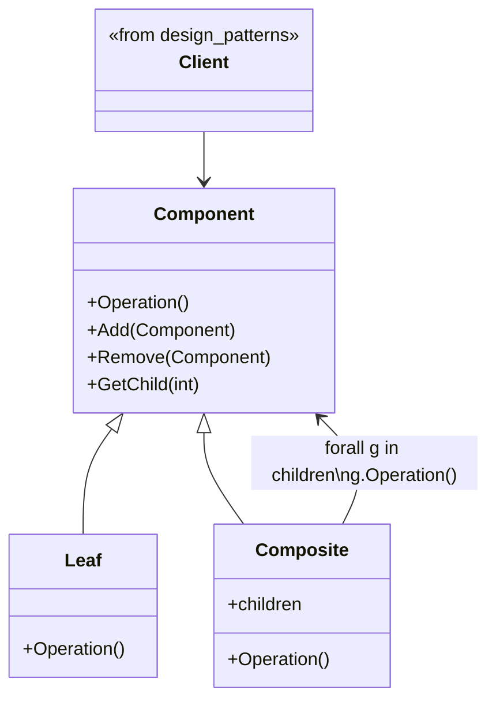

# PATTERN `Composite`



### Code with pattern `Composite`:

```
from abc import ABC, abstractmethod

class IProduct(ABC):
    """Интерфейс продуктов входящих в пиццу"""
    @abstractmethod
    def cost(self) -> float:
        pass

    @abstractmethod
    def name(self) -> str:
        pass

class Product(IProduct):
    """Класс продукта"""

    def __init__(self, name: str, cost: float):
        self.__cost = cost
        self.__name = name

    def cost(self) -> float:
        return self.__cost

    def name(self) -> str:
        return self.__name

class CompoundProduct(IProduct):
    """Класс компонуемых продуктов"""
    def __init__(self, name: str):
        self.__name = name
        self.products = []

    def cost(self):
        cost = 0
        for it in self.products:
            cost += it.cost()
        return cost

    def name(self) -> str:
        return self.__name

    def add_product(self, product: IProduct):
        self.products.append(product)

class Pizza(CompoundProduct):
    """Класс пиццы"""
    def __init__(self, name: str):
        super(Pizza, self).__init__(name)

    def cost(self):
        cost = 0
        for it in self.products:
            cost_it = it.cost()
            print(f"Стоимость '{it.name()}' = {cost_it} рублей")
            cost += cost_it
        print(f"Стоимость пиццы '{self.name()}' = {cost} рублей")
        return cost

if __name__ == "__main__":
    dough = CompoundProduct("тесто")
    dough.add_product(Product("мука", 3))
    dough.add_product(Product("яйцо", 2.3))
    dough.add_product(Product("соль", 1))
    dough.add_product(Product("сахар", 2.1))
    sauce = Product("Барбекю", 12.1)
    topping = CompoundProduct("топпинг")
    topping.add_product(Product("Дор Блю", 14))
    topping.add_product(Product("Пармезан", 12.3))
    topping.add_product(Product("Моцарелла", 9.54))
    topping.add_product(Product("Маасдам", 7.27))
    pizza = Pizza("Четыре сыра")
    pizza.add_product(dough)
    pizza.add_product(sauce)
    pizza.add_product(topping)
    print(pizza.cost())
```

### Plus:

  **1**. Упрощает работу с иерархиями объектов.
 Позволяет клиентскому коду обрабатывать отдельные объекты и их контейнеры одинаково, что уменьшает дублирование логики.
  
  **2**. Легкость добавления новых компонентов.
 Новые элементы можно добавлять в дерево без изменения существующего кода, если соблюдаются интерфейсы.
  
  **3**. Гибкость. 
Можно легко создавать сложные структуры из простых компонентов и управлять ими как единым целым.
  
  **4**. Упрощённое управление структурами. 
Все элементы (листья и ветви) реализуют общий интерфейс, что позволяет реализовать универсальные методы обработки.

### Minus:
  **1**. Может привести к усложнению архитектуры. 
Если иерархия слишком проста, использование Composite может добавить ненужную абстракцию.
  
  **2**. Трудности в ограничении поведения. 
Все элементы реализуют один и тот же интерфейс, поэтому сложно ограничить поведение отдельных компонентов без усложнения кода.
  
  **3**. Усложнение отладки.
 При глубоко вложенных структурах отслеживание ошибок может быть затруднено.
